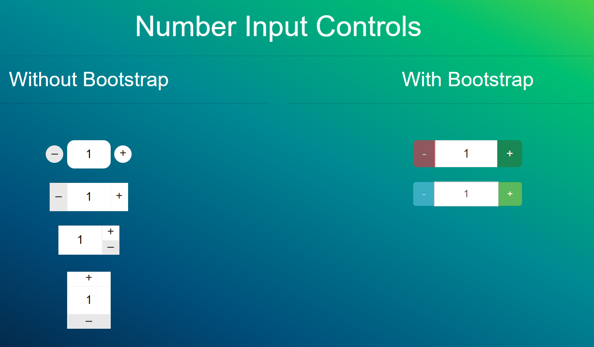

# Number Input Controls

Number Input Controls is a lightweight and customizable JavaScript plugin for modern number input controls. It supports different visual skins and Bootstrap integration, and can be used in both ES module and non-module environments.





## Features
- Customizable skins for a modern look.
- Bootstrap integration for consistent UI.
- Configurable `onPlus` and `onMinus` callbacks.
- Works with both ES modules and global scripts.
- Handles `min`, `max`, and `step` attributes.

## Installation

### Using npm
```bash
npm install number-input-controls
```

### Manual Download
Download the script and include it in your project.

```html
<script src="path-to/number-input-controls.js"></script>
```

## Usage

### ES Module
```javascript
import NumberInputControls from 'number-input-controls';

const numberInputControls = new NumberInputControls({
  selector: '.number-modern',
  skin: 'skin-bootstrap',
  onPlus: (value) => console.log('Plus clicked:', value),
  onMinus: (value) => console.log('Minus clicked:', value),
  bootstrapConfig: {
    size: 'sm',
    buttonClassMinus: 'btn btn-primary',
    buttonClassPlus: 'btn btn-success',
  },
});
```

### Non-Module Environment
```html
<script src="path-to/number-input-controls.js"></script>
<script>
  const numberInputControls = new NumberInputControls({
    selector: '.number-modern',
    skin: 'skin-2',
    onPlus: (value) => console.log('Plus clicked:', value),
    onMinus: (value) => console.log('Minus clicked:', value),
  });
</script>
```

### HTML Example
```html
<input type="number" class="number-modern" min="1" max="10" step="1" value="5">
```

### Options
| Option             | Type       | Default                  | Description |
|--------------------|------------|--------------------------|-------------|
| `selector`         | `string`   | `.number-modern`         | Selector for the number input elements. |
| `skin`             | `string`   | `skin-1`                 | Visual style. Available options: `skin-1`, `skin-2`, `skin-3`, `skin-4`, `skin-bootstrap`, `skin-bootstrap3`. |
| `onPlus`           | `function` | `null`                   | Callback when the plus button is clicked. Receives the updated value as an argument. |
| `onMinus`          | `function` | `null`                   | Callback when the minus button is clicked. Receives the updated value as an argument. |
| `bootstrapConfig`  | `object`   | See below                | Configuration for Bootstrap styling. |

### Bootstrap Config Options
| Option             | Type       | Default                  | Description |
|--------------------|------------|--------------------------|-------------|
| `size`             | `string`   | `''`                     | Size of the input group (`sm`, `lg`, or `''` for default). |
| `buttonClassMinus` | `string`   | `btn btn-default`        | Class for the minus button. |
| `buttonClassPlus`  | `string`   | `btn btn-default`        | Class for the plus button. |

### Clone the Repository
```bash
git clone https://github.com/codevadi/number-input-controls.git
cd number-input-controls
```
 

### Testing
To test your changes, open the `demo.html` file in a browser and interact with the number input.

# License
NumberInputControls is licensed under the MIT License.

# Author

Developed by codevadi, Contributions and feedback are welcome!

Gmail : codevadi@gmail.com
Website : [prestashopexperts](https://prestashopexperts.com/)
